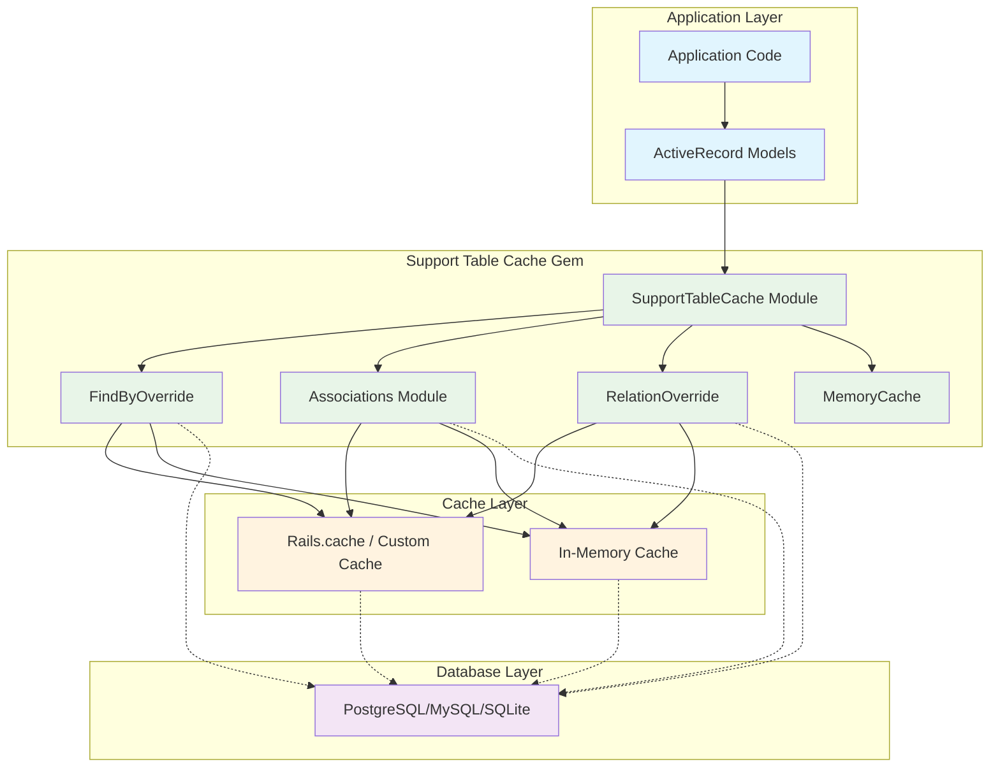
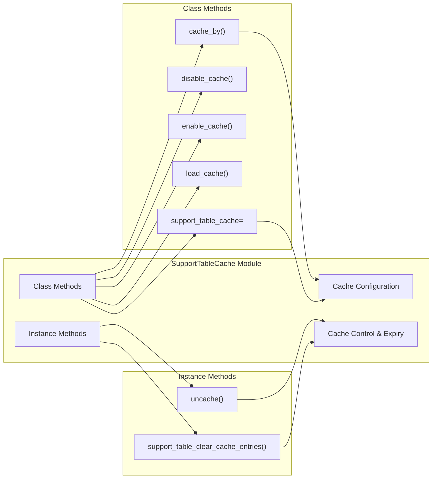
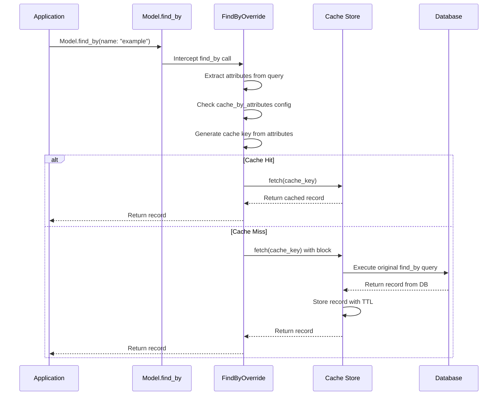
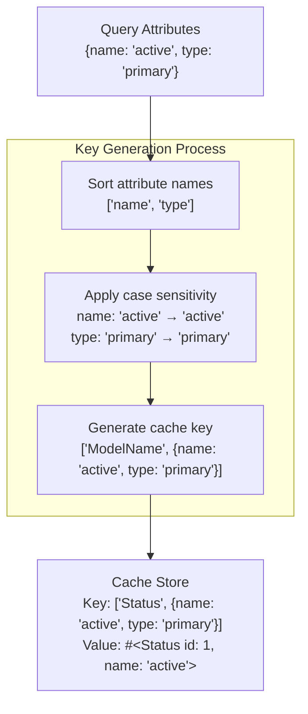
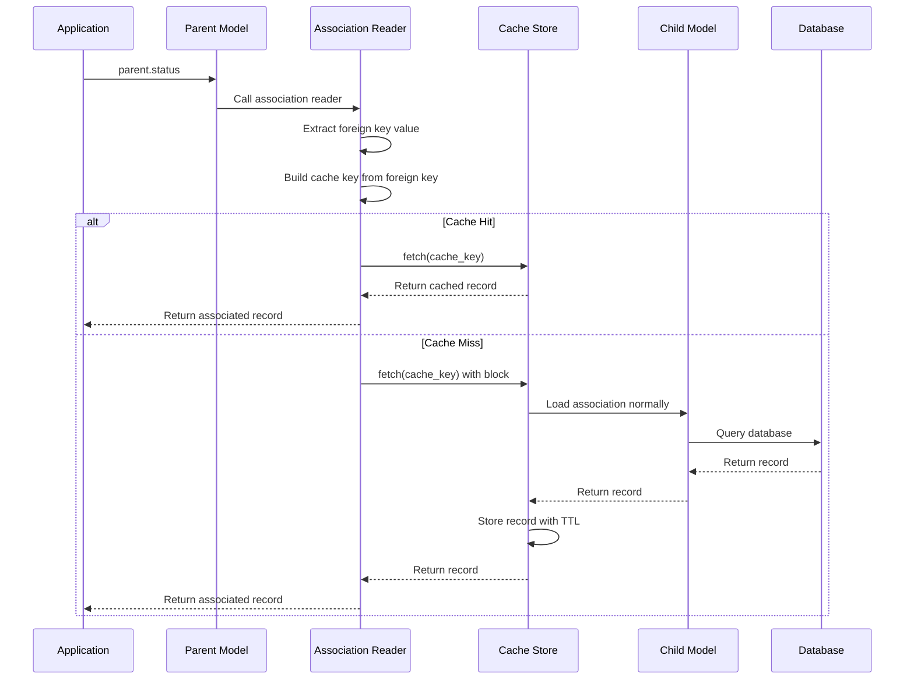
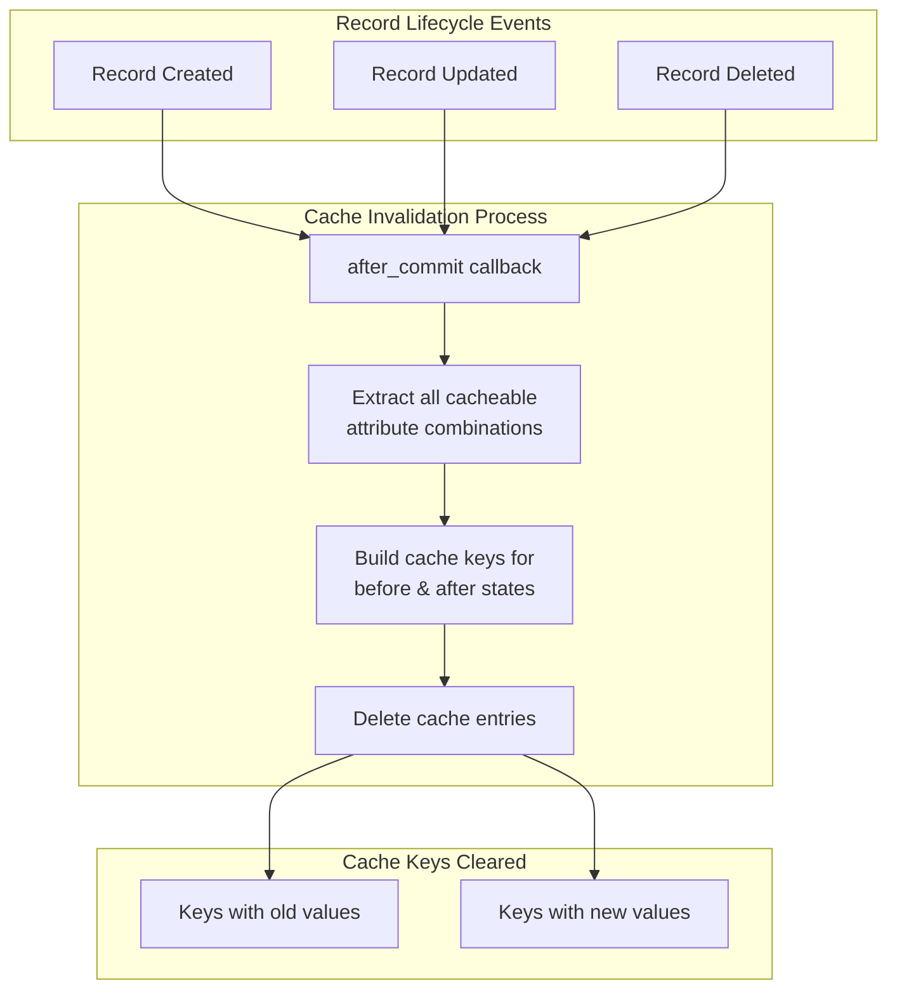
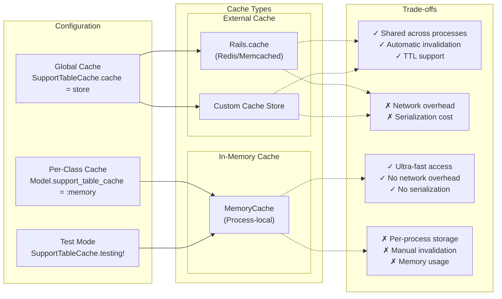
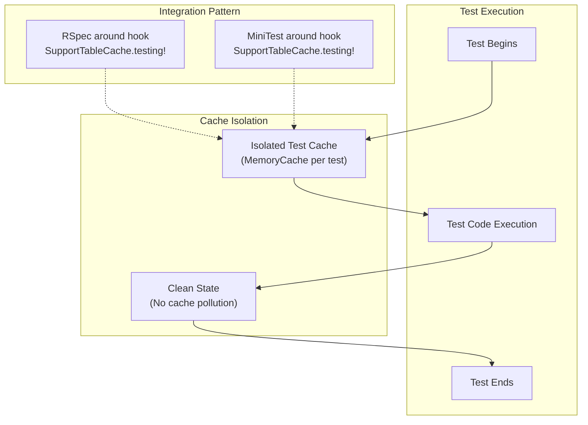
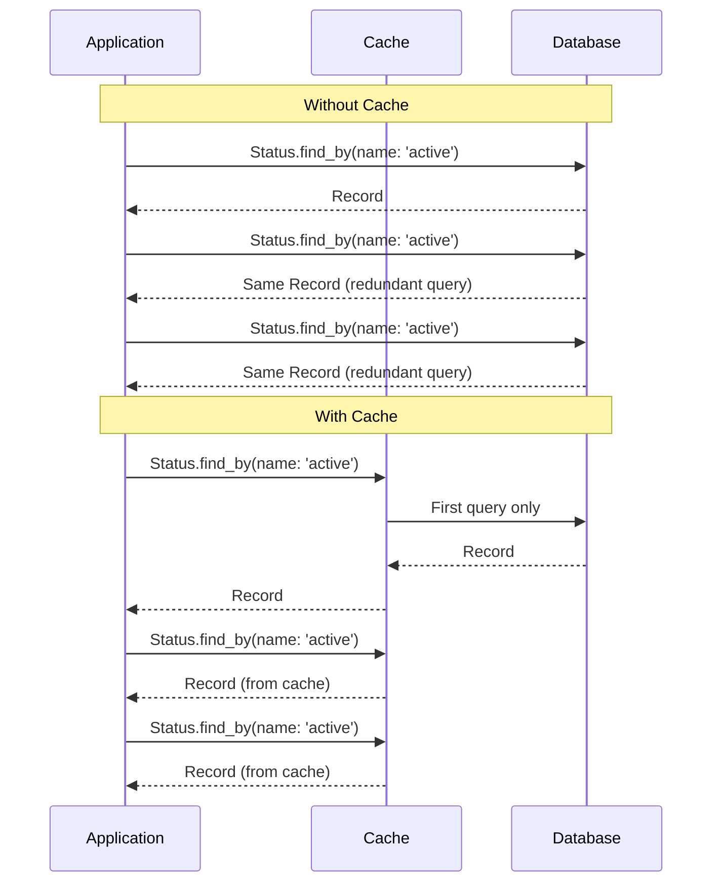

# Support Table Cache Architecture

This document describes the architecture and design of the `support_table_cache` gem, which provides automatic caching for ActiveRecord support table models.

## Overview

Support Table Cache is designed to optimize database queries for small lookup tables (support tables) that have:
- Unique keys (e.g., unique `name` attribute)
- Limited number of entries (a few hundred at most)
- Rarely updated data but frequently queried
- Used for data normalization (lookup tables)

The gem automatically caches records when using `find_by` methods and `belongs_to` associations, eliminating redundant database queries.

## High-Level Architecture



## Core Components

### 1. SupportTableCache Module

The main module that provides caching functionality to ActiveRecord models.



### 2. Cache Key Generation Flow



### 3. Cache Key Structure



### 4. Association Caching Flow



### 5. Cache Invalidation Strategy



### 6. Cache Implementation Types



### 7. Testing Integration



## Configuration Patterns

### Model Setup

```ruby
class Status < ApplicationRecord
  include SupportTableCache

  # Cache by single unique attribute
  cache_by :name, case_sensitive: false

  # Cache by composite unique key
  cache_by [:group, :name]

  # Cache by id (for associations)
  cache_by :id

  # Optional: Set TTL for cache entries
  self.support_table_cache_ttl = 5.minutes

  # Optional: Use in-memory cache
  self.support_table_cache = :memory
end
```

### Association Setup

```ruby
class Order < ApplicationRecord
  include SupportTableCache::Associations

  belongs_to :status
  cache_belongs_to :status
end
```

## Performance Benefits

### Query Elimination



## Design Principles

1. **Transparent Integration**: No code changes required beyond configuration
2. **Selective Caching**: Only caches queries that match configured unique keys
3. **Automatic Invalidation**: Cache entries are cleared when records change
4. **Flexible Cache Backends**: Supports various cache stores including in-memory
5. **Test Isolation**: Provides testing utilities to prevent cache pollution
6. **Performance Optimization**: Minimizes database queries for frequently accessed lookup data

## Use Cases

- **Status/Type Tables**: Small enums stored in database tables
- **Configuration Tables**: Application settings and parameters
- **Reference Data**: Countries, states, categories, etc.
- **Lookup Tables**: Any small, rarely-changing reference data

This architecture enables significant performance improvements for applications that heavily query small support tables while maintaining data consistency and providing flexible caching options.